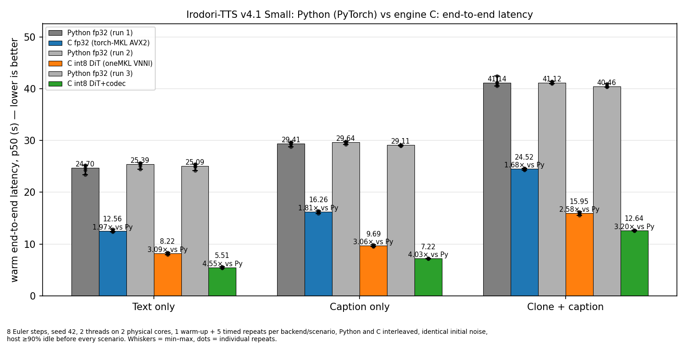
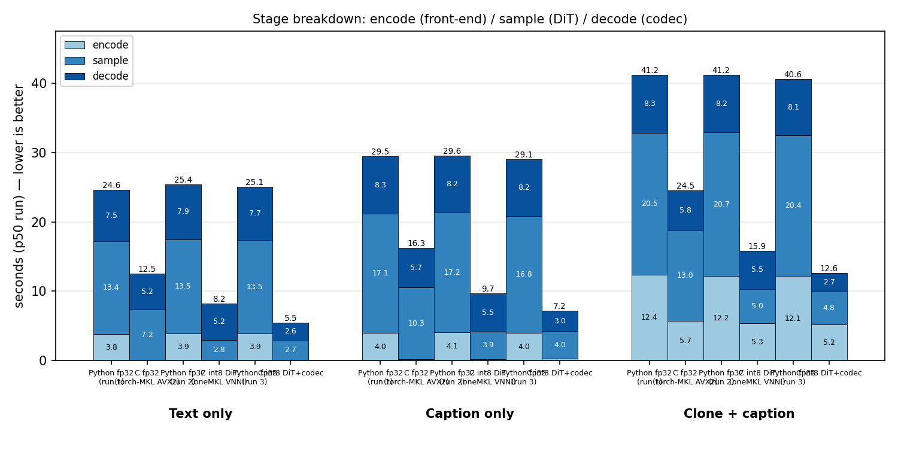
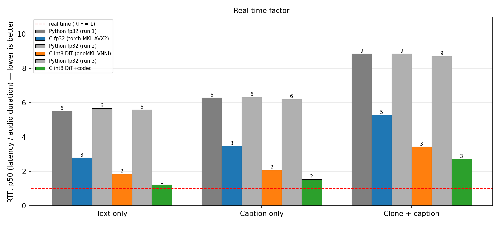
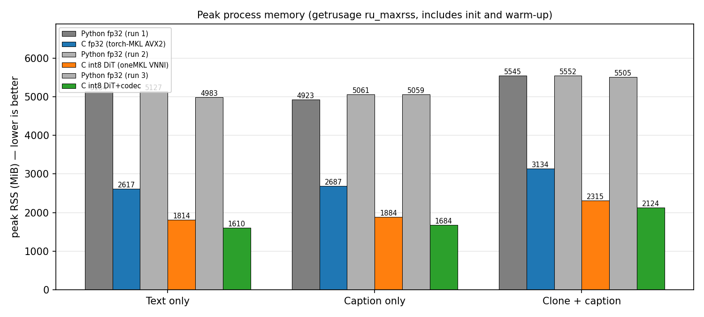
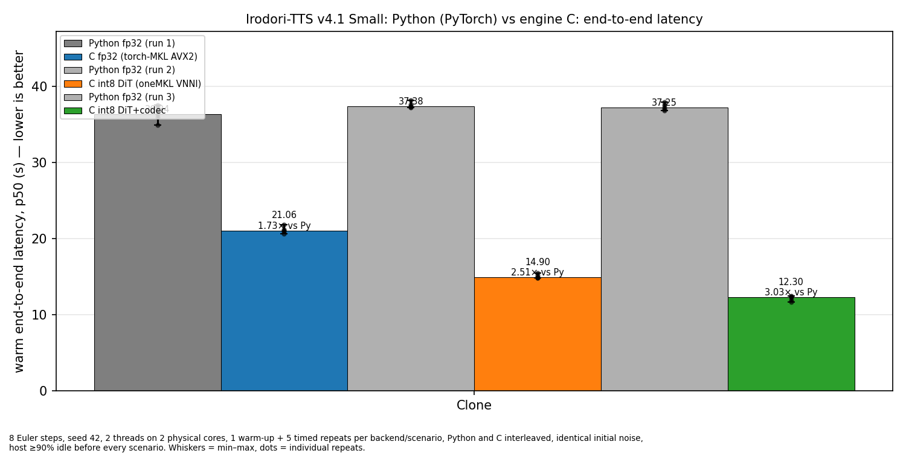
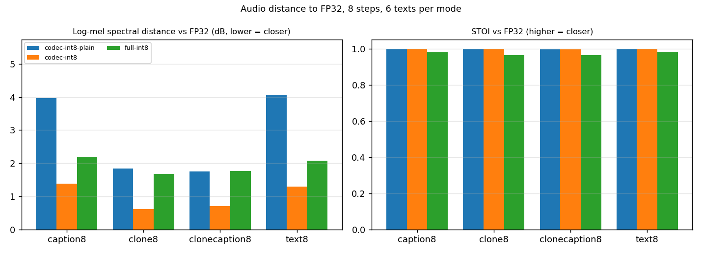

# Irodori C

A dependency-light CPU inference engine, written in C, for
[`Aratako/Irodori-TTS-v4.1-Small`](https://huggingface.co/Aratako/Irodori-TTS-v4.1-Small)
(Japanese text-to-speech: rectified-flow DiT + Semantic-DACVAE codec). The engine
reads the original FP32 safetensors checkpoint through `mmap` and produces
48 kHz mono PCM16 WAV for plain text, caption/style-conditioned speech, and
voice cloning from a reference WAV.

The runtime needs no Python, PyTorch or ONNX. Python is used once to download
and convert assets, and for the development benchmark/parity tooling.

Base implementation: OpenAI Codex. Performance work, int8 paths, quality
gates and benchmark tooling: Claude. See [Credits](#credits).

## Highlights

- Text normalization + Unigram/byte-fallback tokenizer, ModernBERT-ja text
  encoder, duration predictor, RF-DiT with independent CFG (text, speaker,
  caption), Euler sampler, DACVAE encoder/decoder and speaker encoder — all in C.
- FP32 path is bit-comparable to the PyTorch reference (PCM16 within a few
  LSB, golden tensor gates).
- Optional **int8 (W8A8) DiT** and **int8 codec** paths using AVX-512 VNNI
  through oneMKL: on a 2-core laptop CPU text-to-speech runs **4.5× faster
  than the PyTorch reference** at 8 Euler steps, with ~3× less RAM.
- Reusable engine API: load once, serve many requests; prepared-reference
  objects for repeated voice cloning.
- Audio-level quality gates (calibrated spectral distance, ASR CER, blind A/B
  packages) for every numerically non-identical path.

## Requirements

Linux x86-64 (tested on Ubuntu/Pop!_OS, GCC). For the recommended build:

```sh
sudo apt install build-essential libopenblas-dev python3 python3-venv git
```

Optional int8 paths require a CPU with AVX-512 VNNI (Ice Lake or newer,
Zen 4) and an oneMKL runtime (see [Precision options](#precision-options)).
macOS builds use Accelerate.framework for the FP32 path.

Disk: ~3 GB for the FP32 checkpoint plus ~0.4 GB for exported codec assets.
RAM: 1.6–2.1 GB (int8) or 2.6–3.1 GB (FP32) per engine, depending on mode.

## Prebuilt release (no compiler needed)

Linux x86-64 tarballs are published on the
[Releases](https://github.com/misaalya/irodori-c/releases) page: bundled
engine binaries (`irodori-onemkl` with the FP32/int8 oneMKL backend,
`irodori-blas` on OpenBLAS) with their runtime libraries, the demo web UI,
and a separate assets tarball with the tokenizer and codec exports. Only
the 3 GB FP32 checkpoint is downloaded at setup time:

```sh
tar xzf irodori-c-<version>-linux-x86_64.tar.gz && cd irodori-c-<version>-linux-x86_64
tar xzf ../irodori-c-assets-<version>.tar.gz --strip-components=1
./download-model.sh          # or: ./download-model.sh phasefield-audio/Irodori-TTS-v4.1-Anime
bin/irodori-onemkl --text 'こんにちは。' --model weights/model.safetensors \
  --tokenizer weights/tokenizer.bin --decoder weights/dacvae_decoder.safetensors \
  --dit-precision int8 --codec-precision int8 --out out.wav
```

For the web UI (`./run-demo.sh`) see the
[demo repository](https://github.com/misaalya/irodori-c-demo).

Release binaries target the x86-64-v3 baseline (AVX2/FMA); oneMKL dispatches
AVX-512/VNNI kernels at runtime. A native build (`-march=native`) is a few
percent faster on the FP32 parts. `tools/package_release.sh` reproduces the
tarballs.

## Quick start (from source)

Fresh clone to first audio, no Python required:

```sh
sudo apt install build-essential libopenblas-dev curl git     # Debian/Ubuntu
git clone --recurse-submodules https://github.com/misaalya/irodori-c.git
cd irodori-c
make blas                    # ./irodori-blas (FP32, OpenBLAS)
tools/fetch_assets.sh        # weights/: tokenizer + codec from the release, model (~3 GB) from Hugging Face
IRO_NUM_THREADS=2 ./irodori-blas --text 'こんにちは。今日はいい天気ですね。' --steps 40 --seed 42 --out result.wav
```

`tools/fetch_assets.sh phasefield-audio/Irodori-TTS-v4.1-Anime` fetches the
anime fine-tune instead. Set `IRO_NUM_THREADS` to the number of physical cores.

### int8 build (oneMKL)

The int8 paths need the oneMKL runtime, which pip can provide without an
Intel installer:

```sh
python3 -m pip install --target .onemkl mkl mkl-include      # ~1 GB, once
make irodori-onemkl MKL_ROOT=$PWD/.onemkl
IRO_NUM_THREADS=2 ./irodori-onemkl --text 'こんにちは。' --dit-precision int8 --codec-precision int8 --out fast.wav
```

The engine picks the VNNI (`AVX512_E1`) MKL branch itself and refuses to
start int8 on a backend that cannot accumulate exactly (see
[Precision options](#precision-options)). `.onemkl/` is gitignored.

### Web UI

```sh
python3 demo/server.py       # http://127.0.0.1:8080 (demo/ is the irodori-c-demo submodule)
```

### Regenerating the assets yourself (optional)

`tokenizer.bin` and the codec safetensors in the release are produced from the
upstream checkpoints with the tools below; use this if you want to rebuild
them instead of downloading:

```sh
git clone https://github.com/Aratako/Irodori-TTS.git ../Irodori-TTS
python3 -m venv ../Irodori-TTS/.venv && IRO_PY=../Irodori-TTS/.venv/bin/python
"$IRO_PY" -m pip install --upgrade pip huggingface-hub safetensors torch --index-url https://download.pytorch.org/whl/cpu
../Irodori-TTS/.venv/bin/hf download Aratako/Irodori-TTS-v4.1-Small model.safetensors tokenizer/tokenizer.json --local-dir downloads/irodori
../Irodori-TTS/.venv/bin/hf download Aratako/Semantic-DACVAE-Japanese-32dim weights.pth --local-dir downloads/dacvae
cp downloads/irodori/model.safetensors weights/model.safetensors
"$IRO_PY" tools/compile_tokenizer.py downloads/irodori/tokenizer/tokenizer.json weights/tokenizer.bin weights/tokenizer_vectors.json
"$IRO_PY" tools/export_dacvae_decoder.py downloads/dacvae/weights.pth weights/dacvae_decoder.safetensors
"$IRO_PY" tools/export_dacvae_encoder.py downloads/dacvae/weights.pth weights/dacvae_encoder.safetensors
```

The upstream checkout and venv are also what the benchmark and parity tools
under `tools/` use.

## Usage

| Mode | Command |
|---|---|
| Text-to-speech | `./irodori-blas --text '…' --out out.wav` |
| Caption / style | `./irodori-blas --text '…' --caption '落ち着いた自然な女性の声で、やわらかく話す。' --out out.wav` |
| Voice cloning | `./irodori-blas --text '…' --ref reference.wav --out out.wav` |
| Clone + caption | `./irodori-blas --text '…' --ref reference.wav --caption '明るく元気な声で。' --out out.wav` |

Reference WAVs may be PCM16/24/32 or float32, any sample rate, mono or
multichannel; the engine downmixes, resamples to 48 kHz, normalizes loudness,
encodes with DACVAE and builds the speaker condition. Clean single-speaker
recordings give the most stable clones.

Main options:

| Option | Meaning | Default |
|---|---|---|
| `--text` | Japanese text to synthesize | required |
| `--caption` | Style/emotion description | off |
| `--ref` | Reference WAV for voice cloning | off |
| `--steps` | Euler sampling steps (8 = fast preview, 40 = quality) | `40` |
| `--seed` | Deterministic noise seed | `42` |
| `--out` | Output WAV path | `out.wav` |
| `--dit-precision` | `fp32` or `int8` for the DiT (see below) | `fp32` |
| `--codec-precision` | `fp32` or `int8` for the DACVAE decoder | `fp32` |
| `--model`, `--tokenizer`, `--decoder`, `--encoder` | Asset paths (also `IRO_MODEL`, `IRO_TOKENIZER`, `IRO_DECODER`, `IRO_ENCODER`) | `weights/…` |
| `--noise`, `--dump-dir` | Regression/diagnostic inputs and tensor dumps | off |

Environment: `IRO_NUM_THREADS` (BLAS threads), `IRO_DIT_PRECISION`,
`IRO_CODEC_PRECISION`.

### Compatible checkpoints

Any checkpoint with the v4.1-Small architecture works unchanged, e.g. the
fine-tune [`phasefield-audio/Irodori-TTS-v4.1-Anime`](https://huggingface.co/phasefield-audio/Irodori-TTS-v4.1-Anime)
(`--model /path/to/anime/model.safetensors`; same tokenizer and codec). The
engine loads FP32 safetensors only — the `int8-*`/`int4-*`/`float8-*`
torchao variants published upstream are PyTorch formats and are not needed:
the engine quantizes on its own at load time.

## Precision options

FP32 is the default and matches the PyTorch reference. Two opt-in integer
paths trade bit-exactness for speed; both keep the model, step count and all
control paths unchanged and quantize **at engine init** from the FP32 file.

| Path | What is quantized | Payload | Effect |
|---|---|---|---|
| `--dit-precision int8` | The eight dense projections of every DiT block (`wq/wk/wv/gate/wo/w1/w2/w3`), the same layer set as upstream's `int8-dynamic` release. Weights per output channel, activations per row (asymmetric uint8) with a two-term residual on the W2 input. AdaLN, conditioner, context K/V, attention and everything outside the DiT stay FP32. | 257 MiB (FP32 pages of replaced weights are released) | DiT sampling ~3× faster |
| `--codec-precision int8` | Conv7/Conv1/ConvTranspose of the DACVAE decoder via a uint8 im2col with per-output-row scales (one exact int32 GEMM per block); residual term on the last stage. Snake activations, biases and the final tap stay FP32. | 63 MiB | decode ~2× faster |

Backend requirements: the integer GEMM comes from oneMKL
(`cblas_gemm_s8u8s32`); `MKL_ROOT` must hold `include/mkl.h` and
`lib/libmkl_rt.so.3` (the `pip install --target` layout from the quick start,
or an oneAPI installation).

The engine selects the `AVX512_E1` (VNNI) MKL branch when `MKL_CBWR` is
unset and verifies at init that the backend accumulates exactly; the
`AVX2`/`AVX512` conditional-numerics branches saturate int16 intermediates
and are refused. Builds without oneMKL accept the int8 flags but fall back to
a slow scalar reference kernel (correct, for tests only).

Quantization knobs for experiments (not product settings):
`IRO_INT8_RESIDUAL`, `IRO_INT8_MASK`, `IRO_INT8_EMULATE`, `IRO_INT8_STATS`,
`IRO_INT8_DUMP`, `IRO_CODEC_INT8_RESIDUAL`, `IRO_CODEC_INT8_RESIDUAL_STAGES`,
`IRO_CODEC_INT8_MASK`.

## Performance

Measured on an Intel i3-1005G1 (2 cores / 4 threads, sustained ~2.0 GHz,
AVX-512 VNNI), 2 threads pinned to distinct physical cores, 8 Euler steps,
seed 42, identical initial noise, one warm-up plus 5 timed repeats with
Python and C interleaved, host ≥90% idle before every scenario. Latency is
the warm end-to-end time from request to a fully written WAV; RTF = latency /
audio duration (lower is better).

| Scenario | PyTorch FP32 | C FP32 | C int8 DiT | C int8 DiT + codec | RTF (full int8) | Peak RSS Python → C full int8 |
|---|---:|---:|---:|---:|---:|---:|
| Text only | 25.1 s | 12.6 s (1.97×) | 8.2 s (3.09×) | **5.5 s (4.55×)** | 1.23 | 5.0 → 1.6 GB |
| Caption only | 29.1 s | 16.3 s (1.81×) | 9.7 s (3.06×) | **7.2 s (4.03×)** | 1.54 | 5.1 → 1.7 GB |
| Voice clone | 37.3 s | 21.1 s (1.73×) | 14.9 s (2.51×) | **12.3 s (3.03×)** | 2.58 | 5.4 → 2.0 GB |
| Clone + caption | 40.5 s | 24.5 s (1.68×) | 16.0 s (2.58×) | **12.6 s (3.20×)** | 2.72 | 5.5 → 2.1 GB |



Python was measured once per C configuration (interleaved), so the three
grey bars per scenario are the same PyTorch runtime under the three runs;
their spread (≤ 2.8 %) is the host's run-to-run drift.



Int8 removes most of the DiT sampling time and halves the codec decode; on
voice cloning the FP32 reference encoder (~5 s) is now the largest stage.







At 40 steps the C int8 DiT path is 2.2–2.5× faster than C FP32. The FP32
engine runs at ~94% of this host's SGEMM roofline, so further gains come
from integer paths, not FP32 kernels. Benchmark runs, reports and figures are
produced by the tools below into `artifacts/` (kept out of version control);
the figures above were rendered with `tools/plot_three_scenarios.py`.

## Quality

- **FP32**: PCM16 output within 3–58 LSB of PyTorch (SNR 68–85 dB), golden
  tensor gates for every stage (`make test-*-blas`, `tools/compare_clone_golden.py`).
- **int8 DiT**: the 8-step Euler sampler is chaotic, so any ~1 % perturbation
  yields a different valid sample rather than a degraded one; bit-level
  golden gates do not apply. Against FP32 on a 4-mode × 6-text corpus:
  STOI 0.965–0.983, log-mel distance 1.5–1.7 dB (rounding-only floor: 1.000 /
  0.1 dB; a different seed: 0.25 / 21 dB). ASR CER (kotoba-whisper-v2.0)
  identical to FP32.
- **int8 codec**: deterministic given the latent — SNR 32–33 dB vs the FP32
  decoder (bounded by int8 weights), log-mel distance 0.6–1.4 dB, STOI ≥0.99,
  ASR CER identical.



Per mode and 6 texts at 8 steps: `codec-int8-plain` / `codec-int8` are the
decoder alone on identical latents (without / with the default last-stage
residual term), `full-int8` is DiT + codec. For scale, the rounding-only
floor (FP32 AVX2 vs AVX-512) is LSD ≈ 0.1 dB / STOI 1.000 and a different
seed is LSD ≈ 21 dB / STOI 0.25.
- Blind A/B listening packages are generated by `tools/build_int8_blind_ab.py`;
  human ratings are still pending.

If you need output that reproduces the PyTorch reference exactly, use the
FP32 path.

## Demo web UI

A browser front-end for the engine lives in
[misaalya/irodori-c-demo](https://github.com/misaalya/irodori-c-demo)
(checked out here as the `demo/` submodule and bundled in the prebuilt
release). Setup steps for the release and for source builds are in that
repository's README.

## Engine API

```c
#include "generate.h"

IroEngine engine = {0};
IroEngineConfig config = {
    .model_path = "weights/model.safetensors",
    .tokenizer_path = "weights/tokenizer.bin",
    .decoder_path = "weights/dacvae_decoder.safetensors",
    .encoder_path = "weights/dacvae_encoder.safetensors",   /* optional, for --ref */
    .dit_precision = IRO_DIT_PRECISION_INT8,                 /* or FP32 */
    .codec_precision = IRO_DIT_PRECISION_INT8,
};
iro_engine_init(&engine, &config);

IroPreparedReference voice = {0};
iro_engine_prepare_reference(&engine, "reference.wav", &voice, NULL);  /* once per voice */

IroGenerateConfig request = {
    .text = "生成する文章", .prepared_reference = &voice,
    .output_path = "output.wav", .steps = 40, .seed = 42,
};
IroGenerateStats stats = {0};
iro_engine_generate(&engine, &request, &stats);   /* repeat for more requests */

iro_prepared_reference_free(&voice);
iro_engine_free(&engine);
```

Init/generate/free on one engine must be serialized. `IroGenerateStats`
reports stage timings, latent frames, output samples, effective precisions
and int8 payload sizes. Zero-initialize public structs so new fields keep
their defaults.

## Tests and tooling

```sh
make test-audio test-model-io test-int8-ops          # no model needed
make test-tokenizer-boundaries                        # needs weights/tokenizer.bin
make audit                                            # warnings, sanitizers, static analysis
make test-pipeline-blas MODEL=path/to/model.safetensors             # FP32 golden gate
make test-int8-ops-onemkl test-int8-engine-onemkl test-int8-engine-sanitize MKL_ROOT=… MODEL=…
```

Benchmark and evaluation tools (`tools/`, run with the upstream venv):

| Tool | Purpose |
|---|---|
| `bench_four_modes.py` | Interleaved Python-vs-C benchmark with idle gating, provenance and quality gates |
| `bench_speed_tradeoff.py` | C-vs-C A/B (`--experiment int8`, `codec-int8`, `retention`, `packed`, `reference`) |
| `plot_three_scenarios.py` | Publication-style latency/stage/RTF/RAM figures and tables |
| `int8_quality_corpus.py`, `compare_audio_quality.py` | Audio-distance metrics with calibration pairs |
| `asr_cer.py` | Reference-free intelligibility (character error rate) via Japanese Whisper |
| `build_int8_blind_ab.py`, `int8_report.py` | Blind listening packages, report tables and figures |
| `dump_*.py`, `compare_clone_golden.py` | Golden fixtures from the PyTorch runtime and parity checks |

Golden tensors and model weights are not part of the repository.

## Source layout

```text
main.c                 CLI and test dispatcher
generate.c/h           engine lifecycle, request orchestration, prepared references
backbone.c             ModernBERT-ja text encoder
condition.c            text/caption projectors
duration.c             duration predictor
dit.c/h                RF-DiT blocks, int8 DiT path
sampler.c/h            Euler CFG sampler with reusable workspace
dacvae.c/h             DACVAE encoder/decoder, int8 codec path
speaker.c              speaker encoder
audio.c                WAV I/O, resampling, loudness, PCM output
safetensors.c          mmap safetensors loader
ops.c/h                scalar/CBLAS/oneMKL kernels, int8 primitives
tools/                 asset preparation, golden dumps, benchmarks, quality tools
tests/                 unit, boundary, engine and kernel tests
vendor/utf8proc/       Unicode normalization
benchmarks/            figures referenced by this README
artifacts/             local benchmark/evaluation output (gitignored)
```

## License

MIT — see [LICENSE](LICENSE). Third-party components keep their own licenses:
utf8proc (MIT, `vendor/utf8proc`), Intel oneMKL / OpenMP runtime (Intel
Simplified Software License, bundled only in release tarballs), OpenBLAS
(BSD-3). Model weights are MIT with the upstream authors' ethical restrictions.

## Credits

- Engine base implementation (architecture port, FP32 kernels, golden
  parity, engine API): **OpenAI Codex**.
- Refinement (roofline analysis, int8 DiT and codec paths, MKL branch
  correctness, quality-gate methodology, benchmark and reporting tooling):
  **Claude** (Anthropic).
- Model and reference implementation: [Irodori-TTS](https://github.com/Aratako/Irodori-TTS)
  by Chihiro Arata (MIT), built on Echo-TTS, DACVAE, modernbert-ja and SilentCipher.

Model weights follow the upstream MIT license and its ethical restrictions:
do not clone voices without consent or produce misleading content. Intel
oneMKL is distributed under its own license.
