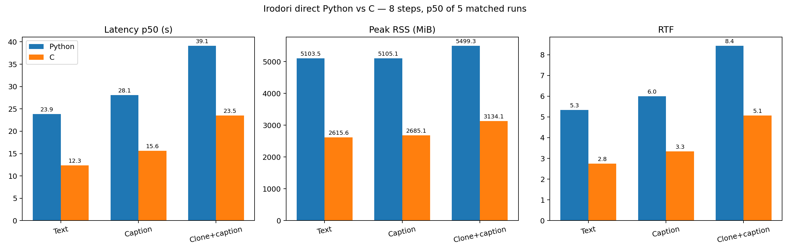
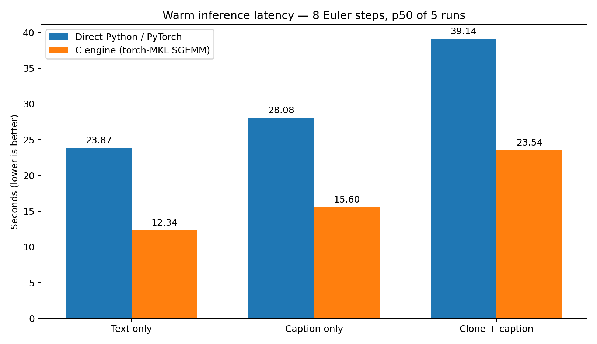
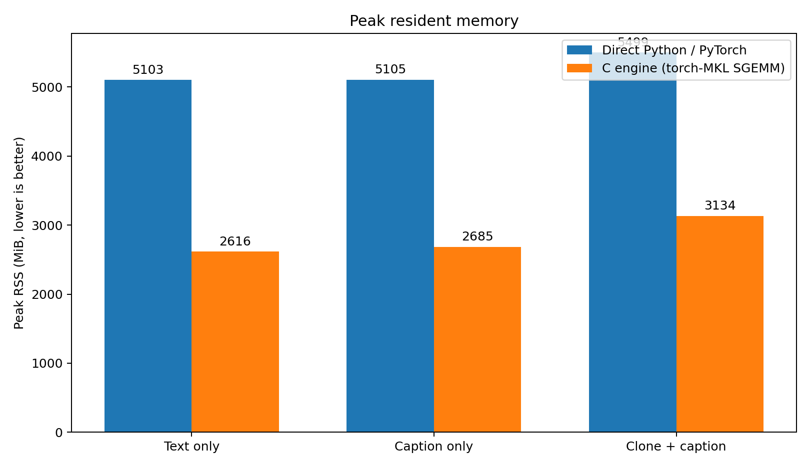
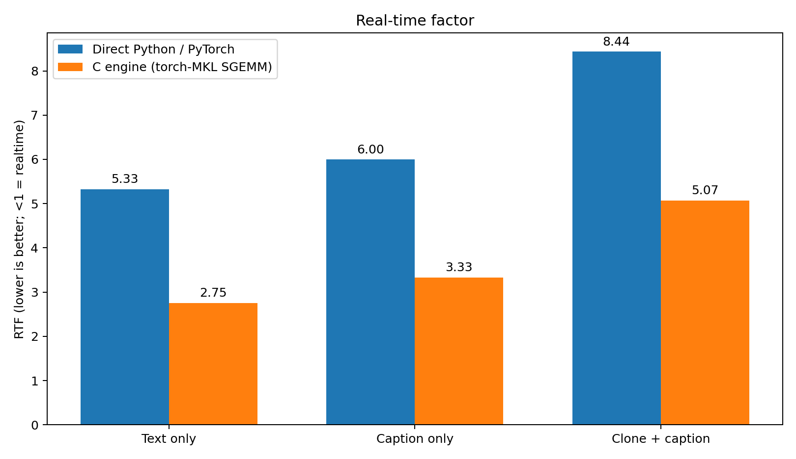

# Irodori C vs direct Python — 3 scenarios

Source: latest complete formal matched run `../benchmark-results/p3-final-20260912-0950/summary.json`.

Configuration: Irodori-TTS v4.1 Small FP32, 8 Euler steps, seed 42, 2 threads pinned to physical CPUs 0 and 1, one warm-up per backend/mode, 5 timed repeats, persistent workers, Python/C interleaved with alternating first backend, identical initial sampler noise, and host idle gate >=90%. The C side used the accepted `torch-mkl-sgemm` backend with `MKL_CBWR=AVX2`.

| Scenario | Python p50 | C p50 | Speedup | Latency cut | Python RAM | C RAM | RAM cut | Python RTF | C RTF | PCM16 max LSB |
|---|---:|---:|---:|---:|---:|---:|---:|---:|---:|---:|
| Text only | 23.873s | 12.336s | 1.94x | 48.3% | 5103 MiB | 2616 MiB | 48.7% | 5.33 | 2.75 | 21 |
| Caption only | 28.076s | 15.596s | 1.80x | 44.5% | 5105 MiB | 2685 MiB | 47.4% | 6.00 | 3.33 | 6 |
| Clone + caption | 39.140s | 23.540s | 1.66x | 39.9% | 5499 MiB | 3134 MiB | 43.0% | 8.44 | 5.07 | 58 |

Fresh rerun note: a new OpenBLAS-worker benchmark was attempted on 2026-09-13, but the PyTorch worker did not reach its READY state within the harness 900-second startup timeout, before any timed sample was recorded. Therefore no partial fresh timing is mixed into this report.
