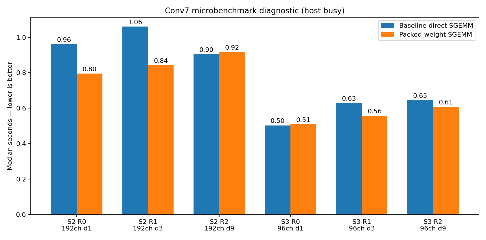
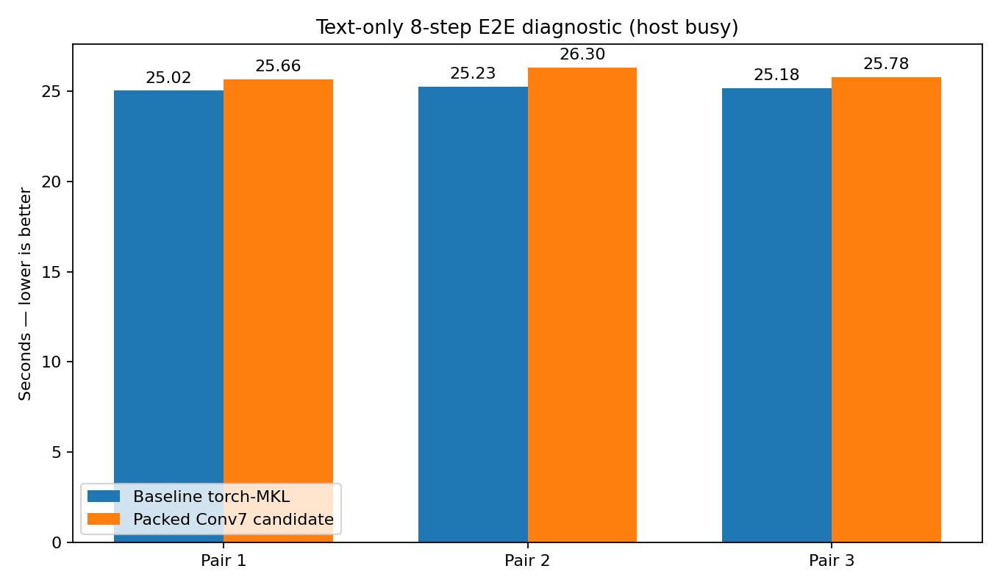

# Packed Conv7 torch-MKL experiment — 2026-09-13

Status: **REJECTED** for direct-speed promotion. Product source was reverted after screening.

## Hypothesis

The stage 2/3 residual Conv7 direct path repeatedly uses the same seven strided weight taps for many 8192-row blocks. The accepted PyTorch-bundled oneMKL 2024.2 runtime exports `cblas_sgemm_pack*`, so weights can be packed once and reused without changing precision, step count, or accumulation order. Candidate used the existing 512 MiB engine packed-cache budget and only targeted full blocks with 192/96 channels; edge/tail GEMMs fell back to baseline.

## Microbenchmark screening

Diagnostic only because host idle was below the >=90% acceptance gate. All six layers were bit-exact against ordinary direct SGEMM (`max_abs=0`, `mae=0`). Sum of per-layer medians was **4.705s baseline -> 4.229s packed (1.112x)**, but individual layers were noisy and two were neutral/regressive.

## Quality

Clone+caption 8-step golden: **PASS** with existing tolerances. Final waveform max error remained `0.0017798543` (limit `0.002`), velocity step 7 `0.0049690604` (limit `0.005`). Candidate cache occupied **317.66 MiB** after warm-up.

## End-to-end screening

Text-only, 8 Euler steps, torch-MKL AVX2, 2 physical cores, three alternating fresh-process pairs with one warm-up per process. Host idle during measured runs ranged **35.1%–46.9%**, so these numbers are diagnostic.

| Pair | Baseline | Packed | baseline/packed | Exact WAV |
|---|---:|---:|---:|---:|
| 1 | 25.017s | 25.662s | 0.975x | yes |
| 2 | 25.234s | 26.297s | 0.960x | yes |
| 3 | 25.178s | 25.785s | 0.976x | yes |

p50: **25.178s -> 25.785s**, i.e. candidate is **2.4% slower**. Decode p50 changed **10.226s -> 11.687s**. Peak RSS changed **2617.3 -> 2633.3 MiB**. Paired speedups were `0.975/0.960/0.976x`; candidate lost all three pairs.

## Decision

Reject this packed Conv7 candidate. It passed numeric quality and looked promising in isolated SGEMM screening, but failed the handoff stop condition at E2E: repeated regressions, 3/3 pairs slower, decode median worse, and extra retained memory. No five-pair/four-mode/formal run is justified. Product changes were surgically reverted; experiment source/logs remain in this directory.

Reproduction artifacts:
- `bench_codec_conv7_packed.c` / `bench-codec-conv7-packed`
- `packed-conv7-diagnostic.jsonl`
- `quality-clone-caption-packed/`
- `e2e-packed-text-diagnostic/summary.json`
