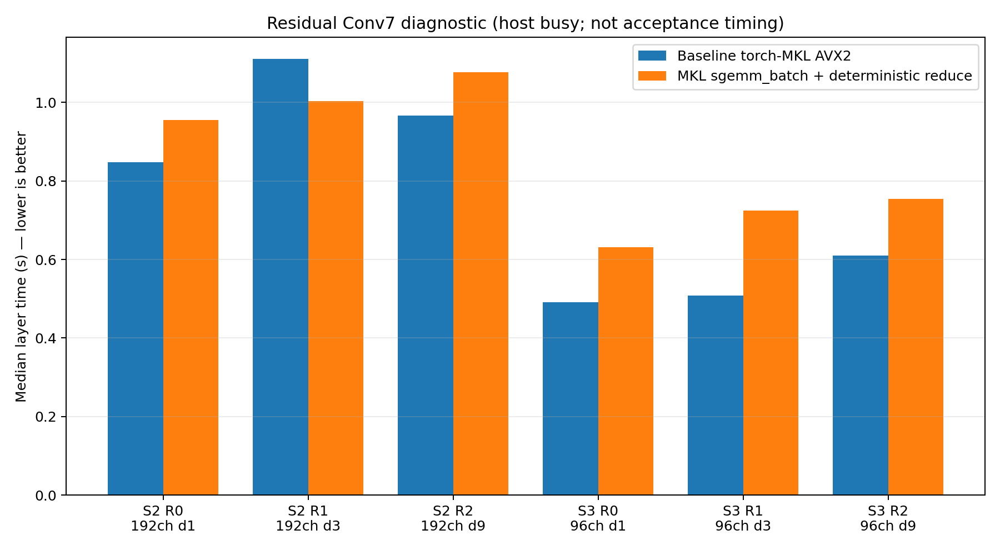
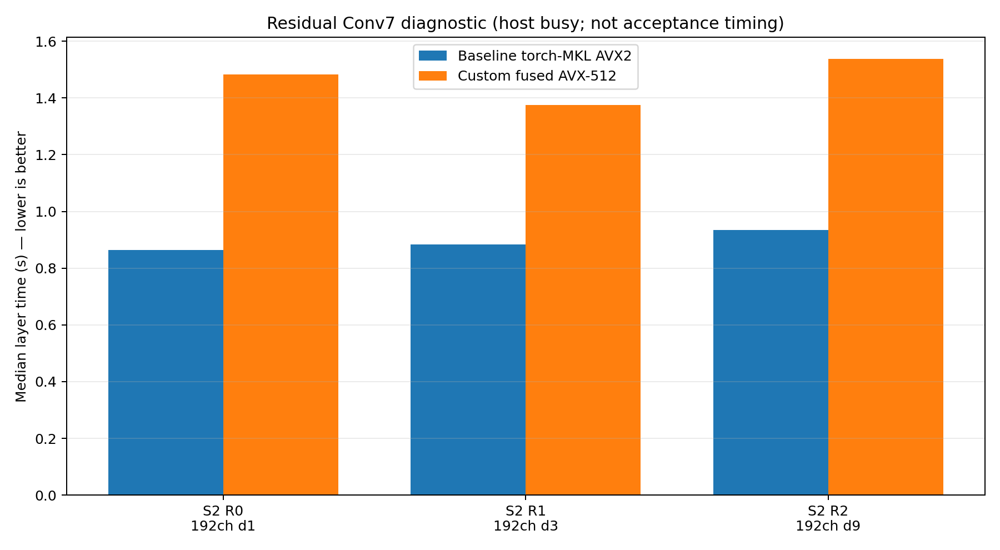

# Conv7 backend/microkernel continuation — 2026-09-13 09:15 WIB

Status: **no candidate promoted**. Both experiments below are rejected before
product integration. The accepted direct backend remains `torch-mkl-sgemm`
with `MKL_CBWR=AVX2`, two threads on physical CPUs 0/1.

Host load average was about 5.4–5.5 on the 4-thread i3-1005G1 during this
continuation, so every timing result here is **diagnostic only**. The existing
formal Python-vs-C three-scenario report remains the latest acceptance-quality
comparison: `../benchmark-python-vs-c-3scenarios-formal-20260913/REPORT.md`.

## 1. oneMKL `cblas_sgemm_batch` Conv7

Hypothesis: run the seven independent tap GEMMs in one MKL batch, write each
tap into a temporary plane, then reduce the seven planes deterministically in
tap order. This removes seven separate API dispatches while keeping FP32 and
the same model/step count. Full 8192-row interior blocks use the batch path;
boundary/tail blocks use the accepted direct SGEMM path.

The candidate was bit-exact against direct SGEMM on all six real residual
fixtures (`max_abs=0`, `mae=0`), but five of six layer medians were slower.

| Layer | Baseline median | Batch median | Baseline / batch |
|---|---:|---:|---:|
| Stage 2 R0, 192ch d1 | 0.848 s | 0.955 s | 0.888x |
| Stage 2 R1, 192ch d3 | 1.110 s | 1.003 s | 1.107x |
| Stage 2 R2, 192ch d9 | 0.967 s | 1.077 s | 0.897x |
| Stage 3 R0, 96ch d1 | 0.491 s | 0.632 s | 0.777x |
| Stage 3 R1, 96ch d3 | 0.509 s | 0.725 s | 0.702x |
| Stage 3 R2, 96ch d9 | 0.610 s | 0.755 s | 0.808x |

Sum of per-layer medians: **4.534 s -> 5.147 s (0.881x)**. Scratch is about
42.0 MiB for 192-channel layers and 21.0 MiB for 96-channel layers. Candidate
is rejected; no product source was changed.

## 2. Custom fused AVX-512 Conv7

Hypothesis: transpose the seven Conv7 tap weights once into `[tap,K,N]`, then
fuse all taps in an AVX-512 kernel so the output remains in registers instead
of being re-read/re-written by seven SGEMMs. The prototype packs about 0.98 MiB
for a 192-channel residual and falls back to SGEMM at block boundaries.

The numerical error stayed small, but performance regressed strongly on all
three 192-channel residuals, so the run was stopped before stage 3 according
to the screening stop condition.

| Layer | Baseline median | AVX-512 median | Baseline / AVX-512 | Max abs |
|---|---:|---:|---:|---:|
| Stage 2 R0, d1 | 0.864 s | 1.482 s | 0.583x | 2.38e-6 |
| Stage 2 R1, d3 | 0.883 s | 1.376 s | 0.642x | 3.10e-6 |
| Stage 2 R2, d9 | 0.935 s | 1.537 s | 0.609x | 3.58e-6 |

Partial sum of medians: **2.683 s -> 4.395 s (0.610x)**. Weight packing itself
was only about 0.5–1.0 ms, so the regression is in the kernel, not preparation.
The likely issue is lower weight reuse / worse cache blocking than MKL's GEMM
microkernels, compounded by AVX-512 frequency behavior on Ice Lake-U.

## 3. Backend availability check

PyTorch ships oneDNN headers locally, but the required `dnnl_*` C API symbols
inside `libtorch_cpu.so` are local/internal rather than exported dynamic
symbols. There is no separate local `libdnnl.so` in the current environment.
Using hidden symbols is not a viable product path, so no oneDNN C prototype was
added.

The bundled MKL also contains internal JIT implementation symbols, but the
public `mkl_jit_create_sgemm` / `mkl_jit_get_sgemm_ptr` entry points are not
exported by `libtorch_cpu.so`; internal entry points are intentionally not used.

## Reproduction artifacts

- `bench_codec_conv7_batch.c` / `bench-codec-conv7-batch`
- `batch-conv7-diagnostic.jsonl`
- `bench_codec_conv7_avx512.c` / `bench-codec-conv7-avx512`
- `avx512-conv7-diagnostic.jsonl`
- `plot_continuation.py`
- `batch-conv7-diagnostic.png`
- `avx512-conv7-diagnostic.png`

Both prototypes compile with `-O3 -march=native -ffast-math -Wall -Wextra
-Werror -std=c11` against the accepted PyTorch `libtorch_cpu.so`. `git diff
--check` passes for the prototype/plot files.

