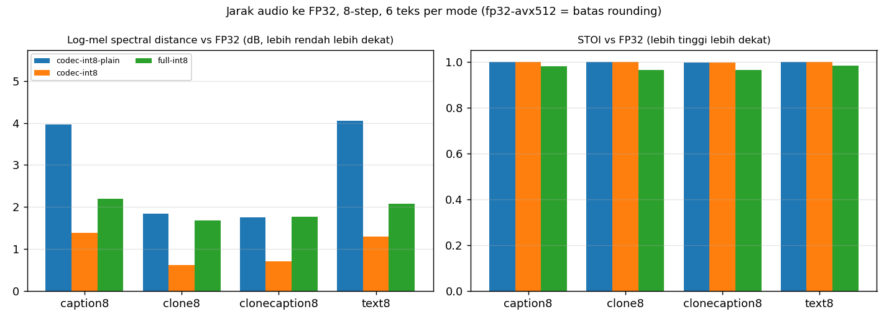
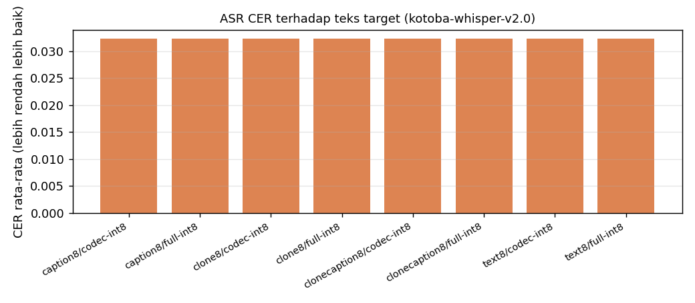
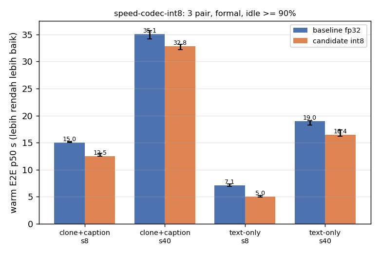
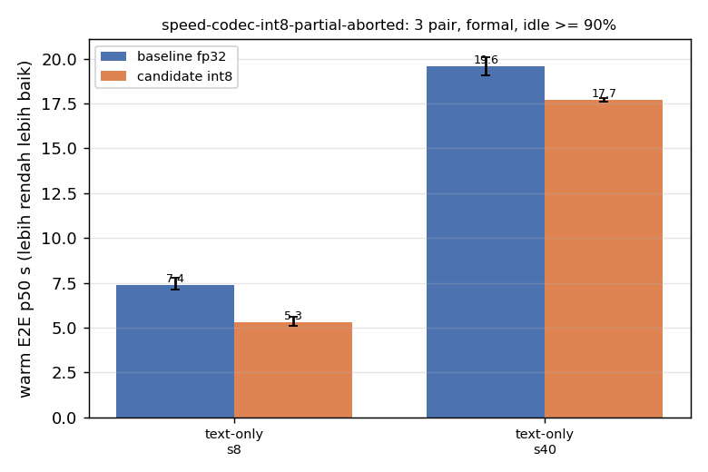

## Kualitas: jarak audio ke FP32

### caption8

| config | n | SNR dB mean/min | LSD dB mean/max | MCD mean/max | STOI mean/min | Euler s median (diagnostik) |
|---|---:|---:|---:|---:|---:|---:|
| fp32 (referensi) | 6 | – | – | – | – | 9.54 |
| codec-int8-plain | 6 | 32.34/31.53 | 3.973/6.036 | 3.41/4.52 | 0.999/0.996 | 9.56 |
| codec-int8 | 6 | 32.35/31.54 | 1.388/2.527 | 3.02/3.97 | 0.999/0.996 | 9.54 |
| full-int8 | 6 | 10.10/4.47 | 2.202/2.969 | 8.15/9.97 | 0.980/0.958 | 3.64 |

### clone8

| config | n | SNR dB mean/min | LSD dB mean/max | MCD mean/max | STOI mean/min | Euler s median (diagnostik) |
|---|---:|---:|---:|---:|---:|---:|
| fp32 (referensi) | 6 | – | – | – | – | 10.74 |
| codec-int8-plain | 6 | 32.71/30.20 | 1.839/2.662 | 3.01/4.95 | 0.998/0.995 | 10.75 |
| codec-int8 | 6 | 32.72/30.21 | 0.617/0.905 | 2.94/4.82 | 0.998/0.995 | 11.06 |
| full-int8 | 6 | 7.67/4.13 | 1.679/2.271 | 8.72/13.04 | 0.965/0.943 | 4.24 |

### clonecaption8

| config | n | SNR dB mean/min | LSD dB mean/max | MCD mean/max | STOI mean/min | Euler s median (diagnostik) |
|---|---:|---:|---:|---:|---:|---:|
| fp32 (referensi) | 6 | – | – | – | – | 13.00 |
| codec-int8-plain | 6 | 33.07/30.69 | 1.753/2.744 | 3.59/5.01 | 0.997/0.991 | 13.27 |
| codec-int8 | 6 | 33.08/30.70 | 0.698/1.240 | 3.54/4.86 | 0.997/0.991 | 13.71 |
| full-int8 | 6 | 6.85/4.27 | 1.764/2.361 | 9.32/12.72 | 0.963/0.952 | 5.13 |

### text8

| config | n | SNR dB mean/min | LSD dB mean/max | MCD mean/max | STOI mean/min | Euler s median (diagnostik) |
|---|---:|---:|---:|---:|---:|---:|
| fp32 (referensi) | 6 | – | – | – | – | 6.85 |
| codec-int8-plain | 6 | 32.22/31.39 | 4.048/6.266 | 3.08/4.07 | 1.000/1.000 | 6.98 |
| codec-int8 | 6 | 32.24/31.39 | 1.300/2.519 | 2.64/3.41 | 1.000/1.000 | 7.11 |
| full-int8 | 6 | 11.08/7.77 | 2.073/3.190 | 8.81/14.02 | 0.983/0.954 | 2.76 |

## Kualitas absolut: ASR CER

| grup | n | CER mean | CER median | CER max | klip CER>0.2 |
|---|---:|---:|---:|---:|---:|
| caption8/codec-int8 | 6 | 0.032 | 0.000 | 0.105 | 0 |
| caption8/full-int8 | 6 | 0.032 | 0.000 | 0.105 | 0 |
| clone8/codec-int8 | 6 | 0.032 | 0.000 | 0.105 | 0 |
| clone8/full-int8 | 6 | 0.032 | 0.000 | 0.105 | 0 |
| clonecaption8/codec-int8 | 6 | 0.032 | 0.000 | 0.105 | 0 |
| clonecaption8/full-int8 | 6 | 0.032 | 0.000 | 0.105 | 0 |
| text8/codec-int8 | 6 | 0.032 | 0.000 | 0.105 | 0 |
| text8/full-int8 | 6 | 0.032 | 0.000 | 0.105 | 0 |

## Kecepatan A/B (harness bench_speed_tradeoff)

### speed-codec-int8 (status complete)

| mode | steps | pair | baseline s | candidate s | speedup | baseline sample s | candidate sample s | RSS base MiB | RSS cand MiB | idle |
|---|---:|---:|---:|---:|---:|---:|---:|---:|---:|---:|
| clone+caption | 8 | 1 | 14.974 | 12.532 | 1.195x | 4.762 | 4.764 | 2311 | 2120 | 94% |
| clone+caption | 8 | 2 | 15.018 | 12.490 | 1.202x | 4.783 | 4.789 | 2312 | 2123 | 94% |
| clone+caption | 8 | 3 | 15.232 | 13.065 | 1.166x | 4.750 | 4.952 | 2312 | 2122 | 94% |
| clone+caption | 40 | 1 | 35.075 | 32.812 | 1.069x | 24.605 | 24.737 | 2313 | 2124 | 94% |
| clone+caption | 40 | 2 | 35.698 | 33.191 | 1.076x | 25.140 | 25.101 | 2313 | 2124 | 94% |
| clone+caption | 40 | 3 | 34.216 | 32.216 | 1.062x | 23.927 | 24.388 | 2313 | 2124 | 94% |
| text-only | 8 | 1 | 6.908 | 5.032 | 1.373x | 2.433 | 2.439 | 1807 | 1610 | 90% |
| text-only | 8 | 2 | 7.062 | 4.904 | 1.440x | 2.464 | 2.419 | 1810 | 1610 | 94% |
| text-only | 8 | 3 | 7.389 | 5.192 | 1.423x | 2.595 | 2.554 | 1811 | 1610 | 94% |
| text-only | 40 | 1 | 18.276 | 16.192 | 1.129x | 13.320 | 13.486 | 1810 | 1610 | 94% |
| text-only | 40 | 2 | 19.055 | 16.421 | 1.160x | 13.842 | 13.699 | 1810 | 1610 | 94% |
| text-only | 40 | 3 | 18.992 | 17.351 | 1.095x | 13.790 | 14.398 | 1810 | 1610 | 94% |

### speed-codec-int8-partial-aborted (status aborted)

| mode | steps | pair | baseline s | candidate s | speedup | baseline sample s | candidate sample s | RSS base MiB | RSS cand MiB | idle |
|---|---:|---:|---:|---:|---:|---:|---:|---:|---:|---:|
| text-only | 8 | 1 | 7.128 | 5.285 | 1.349x | 2.496 | 2.556 | 1802 | 1612 | 90% |
| text-only | 8 | 2 | 7.395 | 5.109 | 1.447x | 2.578 | 2.547 | 1812 | 1612 | 94% |
| text-only | 8 | 3 | 7.777 | 5.606 | 1.387x | 2.735 | 2.735 | 1812 | 1612 | 94% |
| text-only | 40 | 1 | 19.071 | 17.587 | 1.084x | 13.885 | 14.540 | 1812 | 1612 | 91% |
| text-only | 40 | 2 | 20.072 | 17.787 | 1.128x | 14.713 | 14.755 | 1812 | 1612 | 91% |

