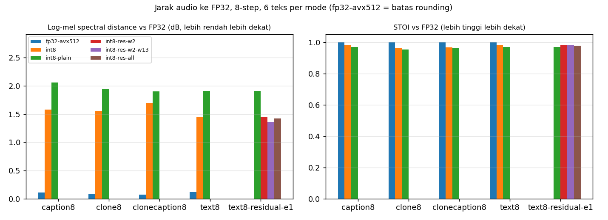
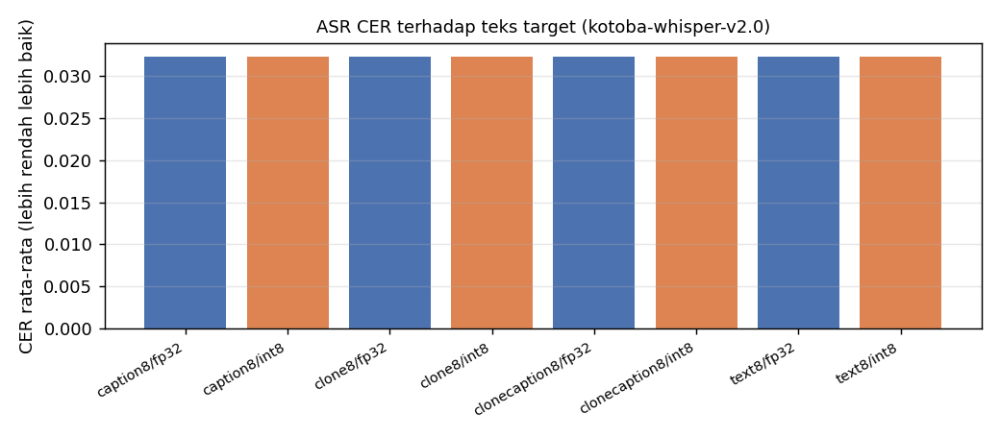
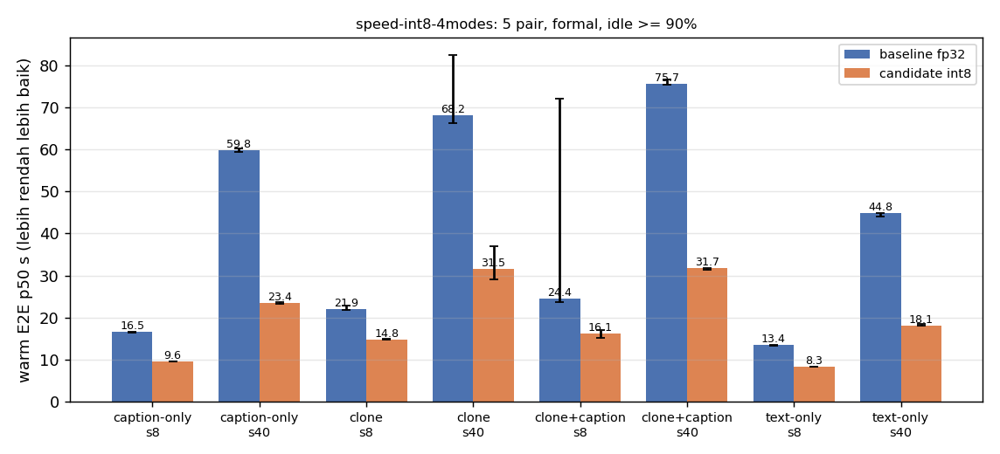
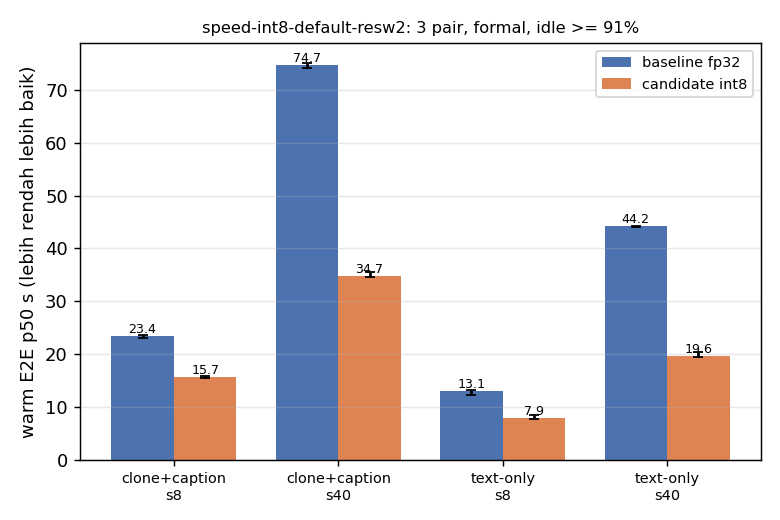
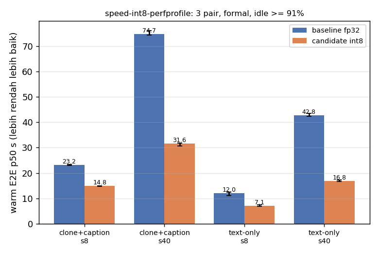

## Kualitas: jarak audio ke FP32

### caption8

| config | n | SNR dB mean/min | LSD dB mean/max | MCD mean/max | STOI mean/min | Euler s median (diagnostik) |
|---|---:|---:|---:|---:|---:|---:|
| fp32 (referensi) | 6 | – | – | – | – | 9.31 |
| fp32-avx512 | 6 | 90.73/87.50 | 0.110/0.169 | 0.01/0.02 | 1.000/1.000 | 9.54 |
| int8 | 6 | 10.11/4.47 | 1.579/2.323 | 7.24/9.23 | 0.981/0.961 | 3.73 |
| int8-plain | 6 | 7.56/2.62 | 2.056/3.017 | 10.59/16.14 | 0.970/0.950 | 3.13 |

### clone8

| config | n | SNR dB mean/min | LSD dB mean/max | MCD mean/max | STOI mean/min | Euler s median (diagnostik) |
|---|---:|---:|---:|---:|---:|---:|
| fp32 (referensi) | 6 | – | – | – | – | 9.95 |
| fp32-avx512 | 6 | 78.88/44.21 | 0.077/0.114 | 0.01/0.03 | 1.000/1.000 | 10.14 |
| int8 | 6 | 7.07/4.98 | 1.556/2.112 | 8.37/11.73 | 0.965/0.945 | 3.95 |
| int8-plain | 6 | 4.50/2.76 | 1.944/2.592 | 9.62/11.90 | 0.952/0.933 | 3.33 |

### clonecaption8

| config | n | SNR dB mean/min | LSD dB mean/max | MCD mean/max | STOI mean/min | Euler s median (diagnostik) |
|---|---:|---:|---:|---:|---:|---:|
| fp32 (referensi) | 6 | – | – | – | – | 12.36 |
| fp32-avx512 | 6 | 86.06/74.09 | 0.075/0.125 | 0.01/0.02 | 1.000/1.000 | 12.41 |
| int8 | 6 | 6.18/4.33 | 1.695/2.096 | 9.08/12.75 | 0.965/0.954 | 5.13 |
| int8-plain | 6 | 5.84/3.36 | 1.900/2.465 | 10.47/14.17 | 0.961/0.945 | 4.12 |

### text8

| config | n | SNR dB mean/min | LSD dB mean/max | MCD mean/max | STOI mean/min | Euler s median (diagnostik) |
|---|---:|---:|---:|---:|---:|---:|
| fp32 (referensi) | 6 | – | – | – | – | 7.09 |
| fp32-avx512 | 6 | 89.95/85.92 | 0.118/0.202 | 0.01/0.01 | 1.000/1.000 | 6.81 |
| int8 | 6 | 11.18/7.74 | 1.449/2.376 | 8.16/13.95 | 0.983/0.954 | 2.65 |
| int8-plain | 6 | 7.18/6.37 | 1.908/3.052 | 10.52/17.51 | 0.969/0.935 | 2.27 |

### text8-residual-e1

| config | n | SNR dB mean/min | LSD dB mean/max | MCD mean/max | STOI mean/min | Euler s median (diagnostik) |
|---|---:|---:|---:|---:|---:|---:|
| fp32 (referensi) | 6 | – | – | – | – | 6.75 |
| int8-plain | 6 | 7.18/6.37 | 1.908/3.052 | 10.52/17.51 | 0.969/0.935 | 2.23 |
| int8-res-w2 | 6 | 11.18/7.74 | 1.449/2.376 | 8.16/13.95 | 0.983/0.954 | 2.69 |
| int8-res-w2-w13 | 6 | 11.58/7.31 | 1.355/2.151 | 7.45/12.33 | 0.981/0.959 | 3.38 |
| int8-res-all | 6 | 9.83/7.49 | 1.426/2.346 | 7.69/12.96 | 0.978/0.952 | 4.17 |

## Kualitas absolut: ASR CER

| grup | n | CER mean | CER median | CER max | klip CER>0.2 |
|---|---:|---:|---:|---:|---:|
| caption8/fp32 | 6 | 0.032 | 0.000 | 0.105 | 0 |
| caption8/int8 | 6 | 0.032 | 0.000 | 0.105 | 0 |
| clone8/fp32 | 6 | 0.032 | 0.000 | 0.105 | 0 |
| clone8/int8 | 6 | 0.032 | 0.000 | 0.105 | 0 |
| clonecaption8/fp32 | 6 | 0.032 | 0.000 | 0.105 | 0 |
| clonecaption8/int8 | 6 | 0.032 | 0.000 | 0.105 | 0 |
| text8/fp32 | 6 | 0.032 | 0.000 | 0.105 | 0 |
| text8/int8 | 6 | 0.032 | 0.000 | 0.105 | 0 |

## Kecepatan A/B (harness bench_speed_tradeoff)

### speed-int8-4modes (status complete)

| mode | steps | pair | baseline s | candidate s | speedup | baseline sample s | candidate sample s | RSS base MiB | RSS cand MiB | idle |
|---|---:|---:|---:|---:|---:|---:|---:|---:|---:|---:|
| caption-only | 8 | 1 | 16.638 | 9.583 | 1.736x | 10.526 | 3.452 | 2626 | 1879 | 95% |
| caption-only | 8 | 2 | 16.470 | 9.544 | 1.726x | 10.366 | 3.451 | 2626 | 1880 | 94% |
| caption-only | 8 | 3 | 16.513 | 9.537 | 1.731x | 10.429 | 3.455 | 2627 | 1881 | 93% |
| caption-only | 8 | 4 | 16.505 | 9.559 | 1.727x | 10.405 | 3.465 | 2627 | 1879 | 94% |
| caption-only | 8 | 5 | 16.574 | 9.571 | 1.732x | 10.400 | 3.462 | 2627 | 1880 | 94% |
| caption-only | 40 | 1 | 59.340 | 23.274 | 2.550x | 53.164 | 17.134 | 2627 | 1880 | 94% |
| caption-only | 40 | 2 | 60.244 | 23.431 | 2.571x | 53.982 | 17.302 | 2626 | 1880 | 94% |
| caption-only | 40 | 3 | 60.097 | 23.463 | 2.561x | 53.816 | 17.288 | 2627 | 1879 | 94% |
| caption-only | 40 | 4 | 59.757 | 23.308 | 2.564x | 53.456 | 17.212 | 2627 | 1880 | 94% |
| caption-only | 40 | 5 | 59.602 | 23.649 | 2.520x | 53.389 | 17.498 | 2626 | 1880 | 90% |
| clone | 8 | 1 | 22.759 | 14.847 | 1.533x | 10.966 | 3.581 | 3004 | 2256 | 94% |
| clone | 8 | 2 | 21.928 | 14.752 | 1.486x | 10.667 | 3.558 | 3012 | 2255 | 94% |
| clone | 8 | 3 | 21.922 | 14.751 | 1.486x | 10.656 | 3.571 | 3012 | 2256 | 90% |
| clone | 8 | 4 | 21.845 | 14.752 | 1.481x | 10.617 | 3.556 | 3012 | 2256 | 94% |
| clone | 8 | 5 | 21.899 | 14.831 | 1.477x | 10.654 | 3.574 | 3012 | 2256 | 95% |
| clone | 40 | 1 | 66.202 | 29.766 | 2.224x | 54.596 | 18.532 | 3012 | 2256 | 94% |
| clone | 40 | 2 | 78.066 | 29.040 | 2.688x | 63.840 | 17.686 | 3012 | 2256 | 94% |
| clone | 40 | 3 | 66.642 | 31.494 | 2.116x | 55.439 | 19.904 | 3001 | 2255 | 93% |
| clone | 40 | 4 | 68.194 | 31.524 | 2.163x | 56.555 | 19.551 | 3011 | 2255 | 94% |
| clone | 40 | 5 | 82.486 | 36.966 | 2.231x | 69.349 | 22.556 | 3011 | 2248 | 94% |
| clone+caption | 8 | 1 | 72.024 | 16.366 | 4.401x | 47.341 | 4.119 | 3090 | 2315 | 95% |
| clone+caption | 8 | 2 | 28.142 | 17.055 | 1.650x | 14.543 | 4.168 | 3089 | 2318 | 91% |
| clone+caption | 8 | 3 | 24.444 | 16.143 | 1.514x | 13.369 | 4.844 | 3089 | 2319 | 92% |
| clone+caption | 8 | 4 | 23.617 | 15.192 | 1.555x | 12.603 | 4.152 | 3089 | 2319 | 92% |
| clone+caption | 8 | 5 | 24.130 | 15.050 | 1.603x | 12.936 | 4.158 | 3089 | 2319 | 92% |
| clone+caption | 40 | 1 | 75.531 | 31.832 | 2.373x | 64.562 | 20.865 | 3089 | 2319 | 92% |
| clone+caption | 40 | 2 | 76.692 | 31.648 | 2.423x | 65.574 | 20.633 | 3089 | 2318 | 91% |
| clone+caption | 40 | 3 | 75.671 | 31.794 | 2.380x | 64.463 | 20.811 | 3089 | 2318 | 92% |
| clone+caption | 40 | 4 | 75.576 | 31.429 | 2.405x | 64.523 | 20.558 | 3089 | 2318 | 92% |
| clone+caption | 40 | 5 | 76.224 | 31.688 | 2.405x | 65.160 | 20.704 | 3089 | 2319 | 92% |
| text-only | 8 | 1 | 13.516 | 8.291 | 1.630x | 7.767 | 2.523 | 2525 | 1808 | 94% |
| text-only | 8 | 2 | 13.402 | 8.227 | 1.629x | 7.677 | 2.503 | 2559 | 1808 | 93% |
| text-only | 8 | 3 | 13.253 | 8.188 | 1.619x | 7.603 | 2.500 | 2554 | 1807 | 91% |
| text-only | 8 | 4 | 13.392 | 8.251 | 1.623x | 7.667 | 2.522 | 2560 | 1808 | 94% |
| text-only | 8 | 5 | 13.411 | 8.376 | 1.601x | 7.698 | 2.593 | 2559 | 1808 | 90% |
| text-only | 40 | 1 | 44.819 | 18.199 | 2.463x | 39.094 | 12.493 | 2559 | 1808 | 93% |
| text-only | 40 | 2 | 44.070 | 18.113 | 2.433x | 38.391 | 12.414 | 2559 | 1808 | 90% |
| text-only | 40 | 3 | 44.528 | 18.050 | 2.467x | 38.805 | 12.409 | 2560 | 1808 | 92% |
| text-only | 40 | 4 | 44.840 | 18.129 | 2.473x | 38.974 | 12.477 | 2559 | 1808 | 93% |
| text-only | 40 | 5 | 44.935 | 18.484 | 2.431x | 39.192 | 12.674 | 2559 | 1809 | 94% |

### speed-int8-default-resw2 (status complete)

| mode | steps | pair | baseline s | candidate s | speedup | baseline sample s | candidate sample s | RSS base MiB | RSS cand MiB | idle |
|---|---:|---:|---:|---:|---:|---:|---:|---:|---:|---:|
| clone+caption | 8 | 1 | 23.639 | 15.872 | 1.489x | 12.617 | 4.986 | 3083 | 2312 | 93% |
| clone+caption | 8 | 2 | 23.085 | 15.475 | 1.492x | 12.550 | 4.774 | 3089 | 2312 | 93% |
| clone+caption | 8 | 3 | 23.372 | 15.744 | 1.485x | 12.538 | 4.889 | 3085 | 2312 | 93% |
| clone+caption | 40 | 1 | 74.739 | 34.682 | 2.155x | 63.944 | 23.981 | 3089 | 2313 | 92% |
| clone+caption | 40 | 2 | 75.071 | 34.728 | 2.162x | 63.998 | 24.020 | 3089 | 2312 | 92% |
| clone+caption | 40 | 3 | 74.181 | 35.465 | 2.092x | 63.474 | 24.800 | 3083 | 2313 | 92% |
| text-only | 8 | 1 | 12.192 | 7.770 | 1.569x | 7.075 | 2.642 | 2551 | 1810 | 93% |
| text-only | 8 | 2 | 13.085 | 7.857 | 1.666x | 7.491 | 2.645 | 2559 | 1811 | 93% |
| text-only | 8 | 3 | 13.156 | 8.451 | 1.557x | 7.604 | 2.926 | 2559 | 1810 | 92% |
| text-only | 40 | 1 | 44.312 | 20.392 | 2.173x | 38.631 | 14.769 | 2540 | 1810 | 92% |
| text-only | 40 | 2 | 44.036 | 19.475 | 2.261x | 38.380 | 14.077 | 2559 | 1810 | 96% |
| text-only | 40 | 3 | 44.223 | 19.574 | 2.259x | 38.578 | 14.087 | 2559 | 1811 | 92% |

### speed-int8-perfprofile (status complete)

| mode | steps | pair | baseline s | candidate s | speedup | baseline sample s | candidate sample s | RSS base MiB | RSS cand MiB | idle |
|---|---:|---:|---:|---:|---:|---:|---:|---:|---:|---:|
| clone+caption | 8 | 1 | 23.448 | 14.776 | 1.587x | 12.624 | 4.113 | 3089 | 2319 | 93% |
| clone+caption | 8 | 2 | 23.175 | 14.885 | 1.557x | 12.599 | 4.113 | 3089 | 2318 | 93% |
| clone+caption | 8 | 3 | 22.972 | 14.832 | 1.549x | 12.524 | 4.136 | 3089 | 2319 | 93% |
| clone+caption | 40 | 1 | 74.695 | 30.727 | 2.431x | 63.831 | 20.132 | 3089 | 2318 | 93% |
| clone+caption | 40 | 2 | 74.391 | 31.621 | 2.353x | 63.545 | 20.695 | 3089 | 2319 | 91% |
| clone+caption | 40 | 3 | 76.073 | 31.804 | 2.392x | 65.049 | 20.943 | 3089 | 2319 | 94% |
| text-only | 8 | 1 | 11.059 | 6.917 | 1.599x | 6.388 | 2.123 | 2560 | 1808 | 93% |
| text-only | 8 | 2 | 12.031 | 7.065 | 1.703x | 6.959 | 2.162 | 2559 | 1809 | 93% |
| text-only | 8 | 3 | 12.380 | 7.354 | 1.683x | 7.133 | 2.248 | 2560 | 1808 | 93% |
| text-only | 40 | 1 | 42.408 | 16.694 | 2.540x | 37.042 | 11.466 | 2560 | 1808 | 93% |
| text-only | 40 | 2 | 43.436 | 17.215 | 2.523x | 38.092 | 11.817 | 2559 | 1808 | 94% |
| text-only | 40 | 3 | 42.812 | 16.764 | 2.554x | 37.540 | 11.485 | 2559 | 1808 | 94% |

