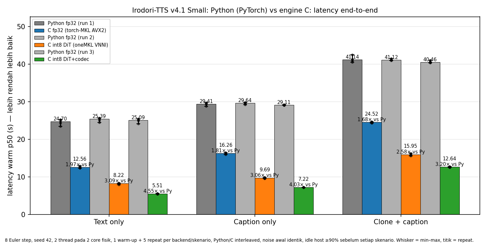
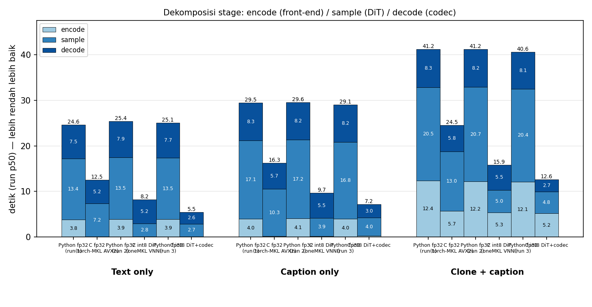
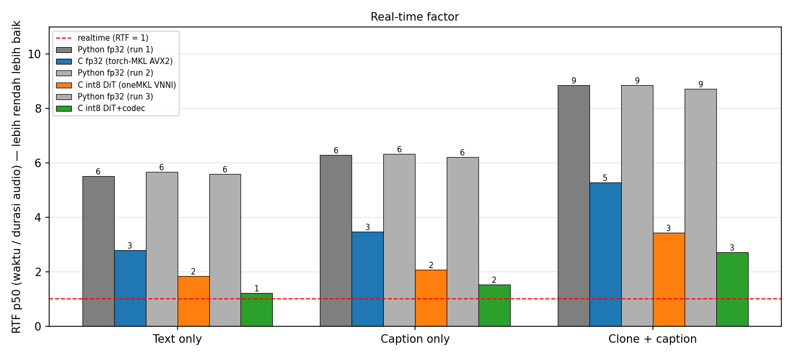
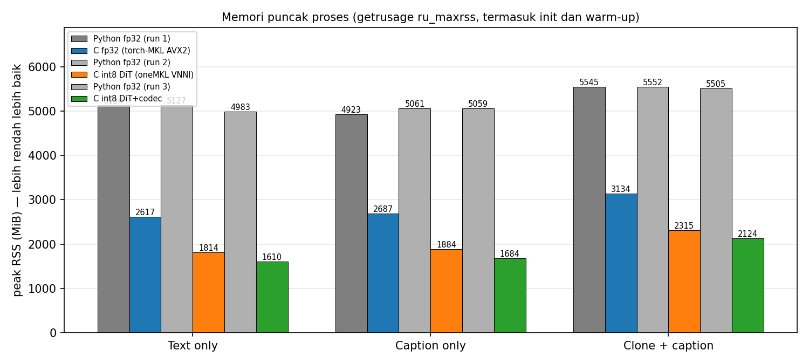
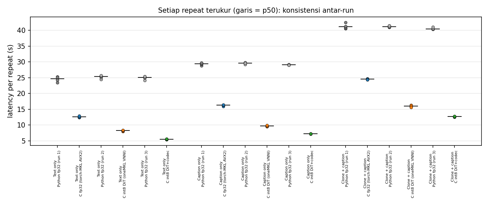
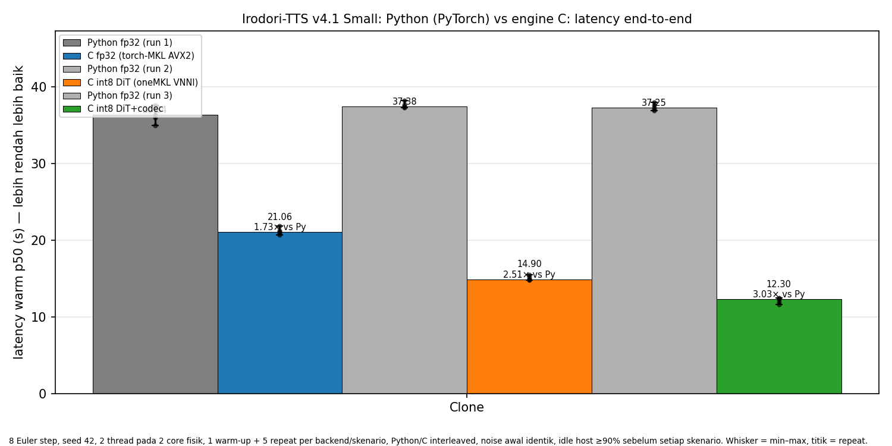
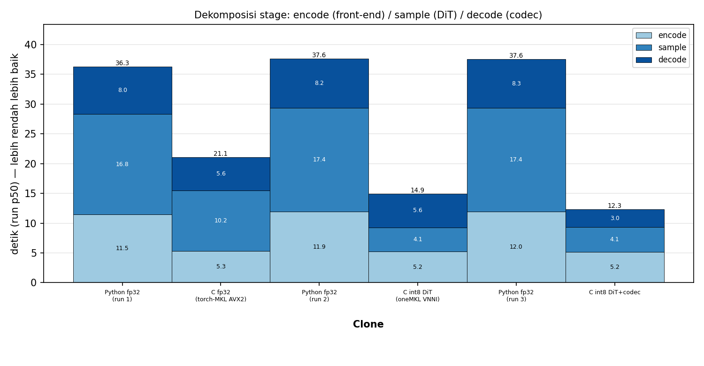

# Python (PyTorch) vs engine C — 3 skenario, 2026-09-14

Replikasi protokol `benchmark-python-vs-c-3scenarios-formal-20260913` (yang
bersumber dari `p3-final-20260912-0950`) dengan satu lengan tambahan: C DiT
int8. Dua run harness `tools/bench_four_modes.py` yang identik kecuali worker C:

- **Lengan A** (`armA-python-vs-c-fp32/`): Python vs C **fp32** —
  `irodori-bench-worker-mkl`, backend accepted `torch-mkl-sgemm`, `MKL_CBWR=AVX2`
  (konfigurasi historis).
- **Lengan B** (`armB-python-vs-c-int8/`): Python vs C **int8 DiT** —
  `irodori-bench-worker-onemkl`, oneMKL 2026.1, `MKL_CBWR=AVX512_E1` (VNNI),
  `IRO_DIT_PRECISION=int8` (kebijakan default: residual W2), codec/front-end FP32.

Python diukur ulang di kedua lengan sebagai **kontrol konsistensi** antar-run.

## Protokol

| Item | Nilai |
|---|---|
| Model | Irodori-TTS v4.1 Small FP32 (snapshot `2b28324d`), codec Semantic-DACVAE, tokenizer bin |
| Skenario | text-only, caption-only, clone+caption; teks/caption sama dengan riwayat; reference `kana-default.wav` |
| Sampler | 8 Euler step, seed 42, noise awal identik Python/C per skenario |
| Thread/afinitas | 2 thread, CPU 0 dan 1 (dua core fisik berbeda) |
| Sampel | 1 warm-up + 5 repeat terukur per backend per skenario, worker persisten, Python/C interleaved dengan backend pertama bergantian |
| Gate host | idle ≥90% (sampling /proc/stat 1 s) sebelum setiap skenario; semua lolos (0,918–0,940) |
| CPU | Intel i3-1005G1 (2 core / 4 thread, AVX-512 VNNI); **tanpa cap frekuensi** (max_perf_pct 100, profil Balanced) — throttling termal dibiarkan, lihat catatan |
| Metrik | latency warm endpoint teks→WAV tertulis penuh; p50/p95/min/max/CV atas 5 repeat; RTF = p50 / durasi audio; peak RSS = `ru_maxrss` seumur proses (termasuk init & warm-up) |
| Provenance | git HEAD `65cdd69b2bd9` + dirty worktree (diff sha256 `a862a669cdce`), hash biner/model/reference di `summary.json` masing-masing lengan |

## Hasil utama (p50 atas 5 repeat)

| Skenario | Python p50 s (run 1 / run 2) | C fp32 p50 s | Speedup fp32 | C int8 p50 s | Speedup int8 | Python RSS MiB | C fp32 RSS | C int8 RSS | RTF Py / C fp32 / C int8 |
|---|---:|---:|---:|---:|---:|---:|---:|---:|---:|
| Text only | 24.70 / 25.39 | 12.56 | **1.97×** | 8.22 | **3.09×** | 5134 | 2617 | 1814 | 5.51 / 2.80 / 1.84 |
| Caption only | 29.41 / 29.64 | 16.26 | **1.81×** | 9.69 | **3.06×** | 4923 | 2687 | 1884 | 6.28 / 3.47 / 2.07 |
| Clone + caption | 41.14 / 41.12 | 24.52 | **1.68×** | 15.95 | **2.58×** | 5545 | 3134 | 2315 | 8.87 / 5.29 / 3.44 |











Tabel lengkap (p95, min–max, CV, latency/RAM cut, determinisme):
[figures/summary.md](figures/summary.md), CSV: [figures/summary.csv](figures/summary.csv).

## Konsistensi

- Python run 1 vs run 2: p50 24,70 / 25,39 (text), 29,41 / 29,64 (caption),
  41,14 / 41,12 s (clone+caption) — selisih ≤2,8%, dan WAV Python **bit-identik**
  antar-run. CV per arm 0,5–2,7%.
- C fp32 hari ini 12,56 / 16,26 / 24,52 s vs formal 2026-09-12 12,34 / 15,60 /
  23,54 s (+1,8…+4,2%); Python 24,70 / 29,41 / 41,14 vs 23,87 / 28,08 / 39,14
  (+3,5…+5,1%). Kedua sisi bergeser searah → drift host, bukan kode; rasio
  speedup fp32 1,97 / 1,81 / 1,68× praktis sama dengan riwayat 1,94 / 1,80 / 1,66×.
- Catatan frekuensi: tanpa cap, clock naik hanya pada burst pendek; beban
  8–40 s memanaskan CPU ke ~90 °C dan thermald menahannya di 2,0 GHz, sehingga
  angka setara dengan run ber-cap (lihat `int8-dit-20260913/REPORT.md` §7).

## Kualitas output benchmark (run ke-5 tiap arm)

| Skenario | PCM16 max LSB C fp32 vs Python | C fp32 vs Python: SNR dB / LSD dB / STOI | C int8 vs Python: SNR / LSD / STOI | ASR CER Python / C fp32 / C int8 |
|---|---:|---:|---:|---:|
| Text only | 21 | 75.8 / 0.29 / 1.000 | 8.2 / 1.32 / 0.974 | 0.111 / 0.111 / 0.111 |
| Caption only | 6 | 85.0 / 0.21 / 1.000 | 1.9 / 3.06 / 0.918 | 0.000 / 0.000 / 0.000 |
| Clone + caption | 58 | 67.8 / 0.12 / 1.000 | 6.1 / 2.48 / 0.958 | 0.000 / 0.000 / 0.000 |

- C fp32 identik dengan Python sampai level rounding (SNR 68–85 dB, STOI 1,000),
  dan gate golden FP32 harness PASS di ketiga skenario.
- C int8 **bukan** reproduksi bit-level Python (by design; gate golden FP32
  tidak berlaku dan dilaporkan FAIL oleh harness untuk caption/clone+caption).
  Jaraknya berada di rentang korpus int8 (LSD 1,3–3,1, STOI 0,92–0,97), jauh
  dari "sampel lain" (LSD ~21, STOI 0,25), dan **CER ASR identik** dengan
  Python/C fp32 (error yang tersisa adalah stutter ASR yang sama di ketiga arm).
  Evaluasi kualitas int8 yang lebih luas (4 mode × 6 teks, blind A/B) ada di
  `artifacts/int8-dit-20260913/REPORT.md`.

## Pembacaan

1. Engine C fp32 memangkas latency 40–49% dan RAM 43–49% terhadap PyTorch —
   konsisten dengan riwayat.
2. DiT int8 menaikkan speedup terhadap Python menjadi **3,09× / 3,06× / 2,58×**
   (latency cut 61–68%, RAM cut 58–65%). RTF turun ke 1,84 / 2,07 / 3,44 pada
   8-step; masih >1, dan sisa waktu kini didominasi decode codec FP32 (5,2–5,5 s)
   serta encode reference (5,3 s pada clone+caption).
3. Batas berikutnya yang terukur: codec (≈65% waktu text-only int8) → kandidat
   int8 berikutnya; encode clone → prepared reference (sudah ada) atau int8
   front-end.

## Reproduksi

```sh
cd /home/kenobu/development/irodori/irodori-c
MODEL=/home/kenobu/.cache/huggingface/hub/models--Aratako--Irodori-TTS-v4.1-Small/snapshots/2b28324dc263ed5e6638b3cf3dd94c82ead07b4b/model.safetensors
REF=/home/kenobu/development/kana-alya/assets/voices/kana-default.wav
PY=../Irodori-TTS/.venv/bin/python
$PY tools/bench_four_modes.py --model $MODEL --ref $REF --binary ./irodori-mkl --c-worker ./irodori-bench-worker-mkl \
  --c-backend torch-mkl-sgemm --c-env MKL_CBWR=AVX2 --threads 2 --steps 8 --repeats 5 \
  --modes text-only,caption-only,clone+caption --skip-caption-effect --work-dir OUT/armA
$PY tools/bench_four_modes.py --model $MODEL --ref $REF --binary ./irodori-onemkl --c-worker ./irodori-bench-worker-onemkl \
  --c-backend onemkl-sgemm --c-env MKL_CBWR=AVX512_E1 --c-env IRO_DIT_PRECISION=int8 --threads 2 --steps 8 --repeats 5 \
  --modes text-only,caption-only,clone+caption --skip-caption-effect --work-dir OUT/armB
$PY tools/plot_three_scenarios.py OUT/armA/summary.json OUT/armB/summary.json \
  --labels "C fp32 (torch-MKL AVX2)","C int8 DiT (oneMKL VNNI)" --out OUT/figures
```

## Tambahan: skenario clone (tanpa caption) — `armA-clone/`, `armB-clone/`

Protokol sama (5 repeat interleaved, idle preflight 0,97 / 0,91), reference
`kana-default.wav`, run terpisah setelah tiga skenario utama.

| Skenario | Python p50 s (run 1 / run 2) | C fp32 p50 s | Speedup fp32 | C int8 p50 s | Speedup int8 | Python RSS MiB | C fp32 RSS | C int8 RSS | RTF Py / C fp32 / C int8 |
|---|---:|---:|---:|---:|---:|---:|---:|---:|---:|
| Clone | 36,34 / 37,38 | 21,06 | **1,73×** | 14,90 | **2,51×** | 5552 | 3058 | 2248 | 7,63 / 4,42 / 3,13 |

Stage p50 (encode / sample / decode): Python 11,5 / 16,8 / 8,0 s; C fp32
5,3 / 10,2 / 5,6 s; C int8 5,2 / 4,1 / 5,6 s — pada clone, encode reference
(speaker encoder + DACVAE encoder, FP32) kini sebesar decode dan bersama-sama
73% waktu int8. CV 0,9–2,6%; Python antar-run +2,9%, WAV bit-identik.

Kualitas run ke-5: C fp32 vs Python PCM16 max 3 LSB, SNR 85,1 dB, STOI 1,000
(golden PASS); C int8 vs Python LSD 1,20, STOI 0,971; CER ASR 0,000 di ketiga arm.





Tabel: [figures-clone/summary.md](figures-clone/summary.md).


## Lengan C: Python vs C **DiT int8 + codec int8** — `armC-python-vs-c-fullint8/`, `armC-clone/`

Run ketiga dengan protokol identik (idle preflight 0,978–0,992, 5 repeat
interleaved), worker oneMKL `MKL_CBWR=AVX512_E1`, `IRO_DIT_PRECISION=int8`
dan `IRO_CODEC_PRECISION=int8` (kebijakan default masing-masing: residual W2
pada DiT, residual stage 3 pada codec). Python diukur ketiga kalinya.

| Skenario | Python p50 s (run 1 / 2 / 3) | C fp32 | C int8 DiT | C int8 DiT+codec | stage full-int8: enc / sample / dec s | RSS Py / C full MiB | RTF Py / fp32 / DiT int8 / full |
|---|---:|---:|---:|---:|---:|---:|---:|
| Text only | 24.70 / 25.39 / 25.09 | 12.56 (1.97×) | 8.22 (3.09×) | **5.51 (4.55×)** | 0.1 / 2.7 / 2.6 | 4983 / 1610 | 5.60 / 2.80 / 1.84 / **1.23** |
| Caption only | 29.41 / 29.64 / 29.11 | 16.26 (1.81×) | 9.69 (3.06×) | **7.22 (4.03×)** | 0.3 / 4.0 / 3.0 | 5059 / 1684 | 6.22 / 3.47 / 2.07 / **1.54** |
| Clone | 36.34 / 37.38 / 37.25 | 21.06 (1.73×) | 14.90 (2.51×) | **12.30 (3.03×)** | 5.2 / 4.1 / 3.0 | 5442 / 2048 | 7.82 / 4.42 / 3.13 / **2.58** |
| Clone + caption | 41.14 / 41.12 / 40.46 | 24.52 (1.68×) | 15.95 (2.58×) | **12.64 (3.20×)** | 5.2 / 4.8 / 2.7 | 5505 / 2124 | 8.72 / 5.29 / 3.44 / **2.72** |

Python antar tiga run: 24,70 / 25,39 / 25,09 (text), 29,41 / 29,64 / 29,11
(caption), 41,14 / 41,12 / 40,46 (clone+caption), 36,34 / 37,38 / 37,25
(clone) — sebaran ≤2,8%, WAV bit-identik. CV lengan C 0,5–2,6%.

Setelah codec int8, decode turun 5,2–5,5 → 2,5–2,8 s; pada text-only sisa
waktu ≈ sampling 2,6 + decode 2,7 s, dan **RTF 1,23** (audio 4,48 s dalam
5,51 s). Pada clone, encode reference FP32 (5,0–5,3 s) kini ≈40% waktu.


Kualitas run ke-5 lengan C vs Python (SNR dB / LSD dB / STOI):

| Skenario | C int8 DiT+codec vs Python |
|---|---:|
| text-only | 8.1 / 2.00 / 0.973 |
| caption-only | 1.9 / 3.64 / 0.915 |
| clone | 9.5 / 1.70 / 0.967 |
| clone+caption | 8.5 / 2.06 / 0.966 |

Sebanding dengan lengan B (DiT int8 saja: LSD 1,2–3,1, STOI 0,92–0,97);
gate langsung codec dan CER ASR ada di `../int8-codec-20260914/REPORT.md`.
Tabel lengkap: [figures/summary.md](figures/summary.md),
[figures-clone/summary.md](figures-clone/summary.md).
